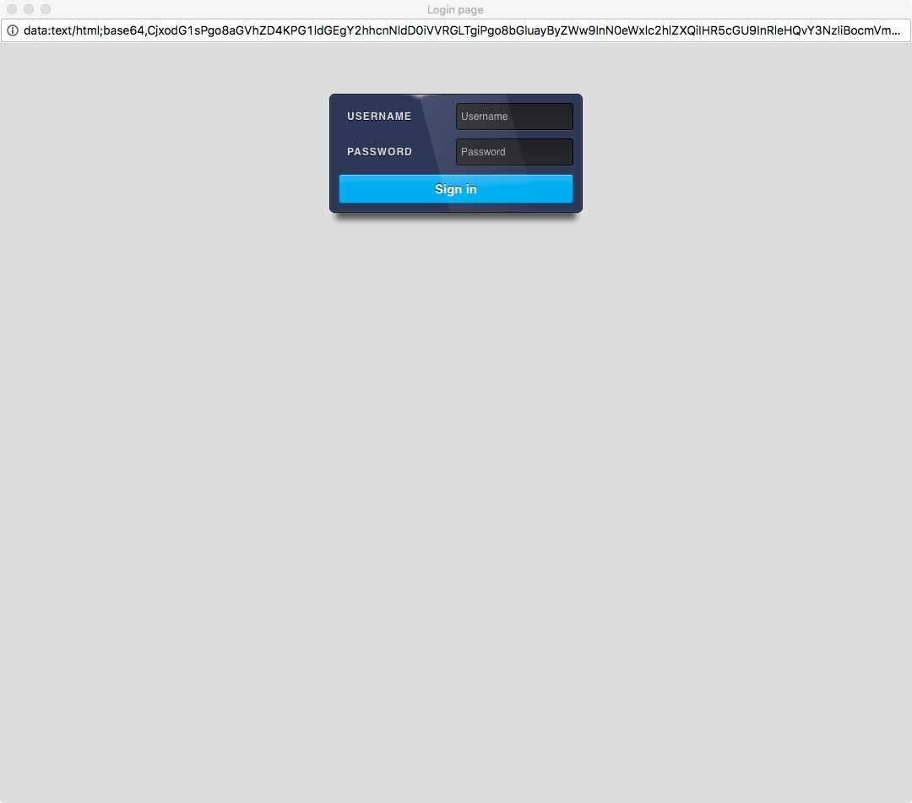
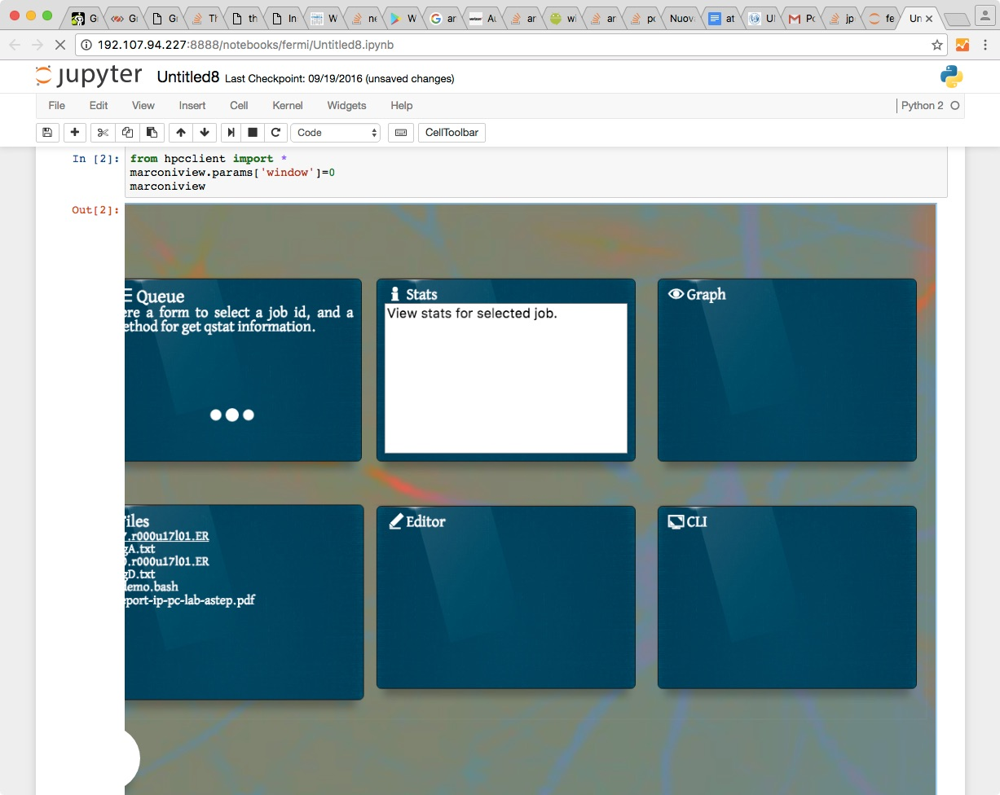
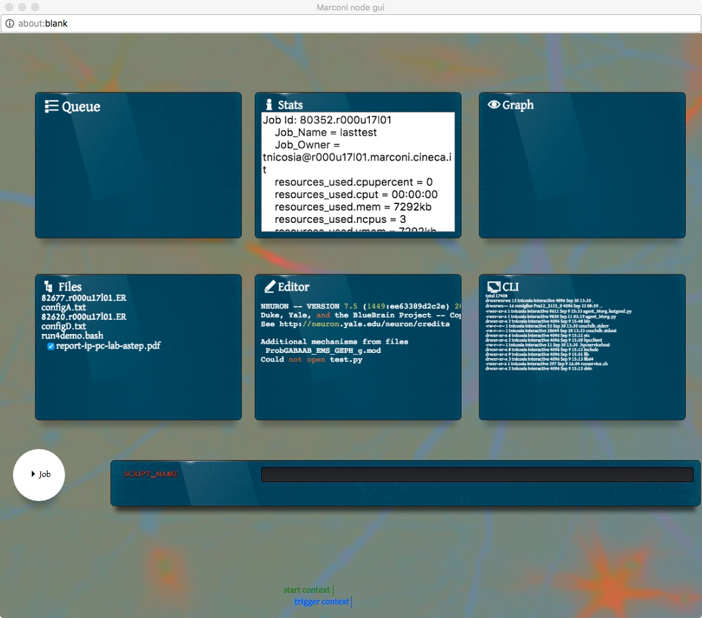

#hpcclient
*a Notebook module for hpc middleware with cloud services extension*
----------------
**python system/user module dependencies**
> **module**
> modular extension for the ipython interface, that embed an enhanced widget for ui
>
- sshtunnel
- threading
- requests
- time
- pyuv 
- HTMLParser
- base64
- hashlib


------------------
> **agents**
> agent is a standalone process for host with sh like cli 
> python 2.7 modules needed
>
- pyuv
- hashlib
- base64
- multiprocessing
- requests
- xmlrpclib
- os
- pycurl
- time
- subprocess
- sys


#What is

Full stack system for [Jupyter](http://jupyter.org/) that bring the power of computational node from deep HPC hardware to user frontend and extended through responsive graphical interface: 
*all across ssh-tunnel connection.*

Commands, files and datastreams (stdin, stdout, stderr) are stored and can be shared in near real-time. (multiple users todo)
Filter function can be implemented for execution of customized script for pre-post elaboration, for files, commands and streams.

Responsive user interface is embedded in module and is executed by front-end.


### HPC login node installation:

*TODO*

### Client installation:

* download and extract on user folder or PYTHONPATH module folder 
* create 'webfolder' for share file between HPC node.

### example code

load module with:
```python
from hpcclient-master import *
```
run webgui for access to remote HPC node on iframe:
```python
marconiview
```




or webgui on popup window:
```python
marconiview['window']=1
marconiview
```


*alternative you can commit command on remote node typing on cell*
```python
hpcrpc.execute('command')
```
*or*
```python
hpcrpc.command('param')
```

#### example 
long format file list
```python
hpcrpc.ls('-la')
```

### Ready GUI functions

* multiple file download with drag and drop
* console for remote node 
* file manipulation (delete, share and unshare)
* qstat report
* mime visualization (jpg, pdf, etc..)
* text file editor
* simplified pbs job submit

### TODO

* concurrent multiple users
* VR enhancement
* Data stream I/O for HPC computational node
* 3D data representation


